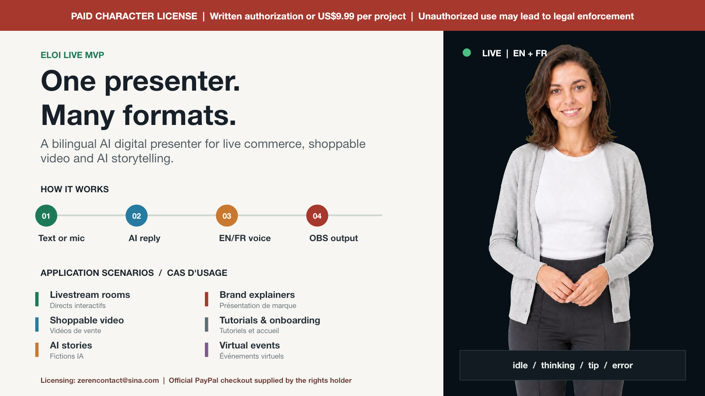

# Eloi Live MVP

> [!CAUTION]
> **PAID ELOI IMAGE LICENSE REQUIRED.** Unless you have written authorization from the rights holder, using Eloi's identity, likeness, or images requires a **US$9.99 Single Project License**. Unauthorized copying, publishing, commercial use, model training, resale, or other misuse may lead to takedown requests, damages claims, and legal action. Contact [zerencontact@sina.com](mailto:zerencontact@sina.com) to receive the official PayPal checkout link.

<p align="center">
  
</p>

<p align="center">
  <strong>A bilingual AI digital presenter for live commerce, shoppable video, AI stories, and more.</strong>
</p>

<p align="center">
  <a href="assets/eloi-live-overview.pptx"><strong>Download the editable one-page PowerPoint</strong></a>
  ·
  <strong>English</strong>
  ·
  <a href="README.fr.md">Français</a>
</p>

> [!NOTE]
> This repository is an implementation package, not a hosted livestream application. It provides the architecture, character rules, state assets, example configuration, and verification checklist needed to integrate Eloi into a web, video, or OBS workflow.

## What Eloi Live does

An operator or viewer types or speaks, an AI produces an English or French reply, Eloi speaks it with a warm female voice, her visual state changes automatically, and OBS receives a transparent presenter layer.

```text
Text input or microphone
          │
          ▼
Speech-to-text, if needed
          │
          ▼
Configured AI endpoint
English or French reply
          │
    ┌─────┴─────┐
    ▼           ▼
Visual state   Bilingual TTS
    └─────┬─────┘
          ▼
Transparent OBS Browser Source
```

## Application scenarios

| Scenario | How Eloi can be used |
| --- | --- |
| **Livestream rooms** | Virtual host, co-host, chat responder, product guide, or multilingual presenter. |
| **Shoppable videos** | Product demonstrations, feature explanations, offers, calls to action, and reusable sales clips. |
| **AI stories and episodic content** | Recurring character, interactive fiction, scripted scenes, educational stories, or short-form series. |
| **Multilingual social video** | English/French versions of Reels, Shorts, TikTok videos, and community updates. |
| **Brand and product explainers** | Product introductions, feature walkthroughs, release announcements, and campaign content. |
| **Tutorials and onboarding** | Step-by-step guidance, course content, software onboarding, and FAQ videos. |
| **Virtual events and webinars** | Event host, session introduction, agenda guide, transition presenter, or recap speaker. |
| **Customer and community content** | Help-center videos, welcome messages, community moderation prompts, and service updates. |

## Eloi's four live states

<table>
  <tr>
    <th width="25%">Idle</th>
    <th width="25%">Thinking</th>
    <th width="25%">Tip</th>
    <th width="25%">Error</th>
  </tr>
  <tr>
    <td></td>
    <td></td>
    <td></td>
    <td></td>
  </tr>
  <tr>
    <td>Listening, waiting, or finished speaking.</td>
    <td>The AI is preparing a response.</td>
    <td>Eloi is giving advice or a useful conclusion.</td>
    <td>A recoverable service or input problem occurred.</td>
  </tr>
</table>

The four PNG files use alpha transparency and are intended for a bottom-anchored OBS overlay.

## Included implementation scope

- English and French text input;
- microphone capture after an explicit user action;
- optional speech-to-text;
- an adapter for the selected AI endpoint;
- warm adult female English/French text-to-speech;
- deterministic `idle`, `thinking`, `tip`, and `error` transitions;
- a separate transparent route for OBS Browser Source;
- recovery behavior for microphone, network, AI, and TTS failures.

The package does not include a hosted AI service, API credits, streaming-platform accounts, Live2D rigging, or a finished 3D model.

## Quick start

### 1. Obtain image authorization

Before publishing Eloi, request written authorization or purchase the **US$9.99 Single Project License** through the official PayPal link supplied by the rights holder.

### 2. Follow the implementation guide

Use [SKILL.md](SKILL.md) as the build specification. Copy the state assets and [example configuration](assets/eloi-live.config.example.json) into the target project.

### 3. Connect AI and voice services

```json
{
  "assistant": {
    "endpoint": "/api/assistant/reply",
    "replyLanguages": ["en", "fr"]
  },
  "speech": {
    "preferredVoiceGender": "female",
    "preferredVoiceMode": "single-multilingual-voice"
  },
  "overlay": {
    "transparent": true
  }
}
```

Keep provider credentials on the server. Do not expose API keys in browser code.

### 4. Add the overlay to OBS

Use the generated overlay URL as an **OBS Browser Source**.

- Landscape starting size: `1920 × 1080`
- Portrait starting size: `1080 × 1920`
- Background: transparent
- Character position: bottom center

## Eloi image licensing

The repository uses two separate license layers:

| Material | License |
| --- | --- |
| Implementation instructions, example configuration, and original software code | [MIT License](LICENSE) |
| Eloi identity, likeness, character design, and `assets/eloi-*.png` | [Proprietary Eloi Asset License](LICENSE-ELOI-ASSETS.md) |

Before using Eloi in a livestream, video, website, application, advertisement, product, social-media channel, dataset, or model-training workflow, obtain either:

1. written authorization from the rights holder; or
2. a **US$9.99 Single Project License**.

**Licensing contact:** [zerencontact@sina.com](mailto:zerencontact@sina.com)<br>
**Suggested subject:** `Eloi License - [Project Name]`

Describe the project, product, website, application, or channel that will use Eloi. The rights holder will send the official PayPal checkout link. The license becomes active only after PayPal confirms completed payment.

Cloning, downloading, forking, or installing this repository does **not** grant permission to publish, commercialize, train on, resell, sublicense, or create derivative character assets from Eloi. The rights holder reserves all available remedies against unauthorized use.

## Repository map

```text
eloi-live-mvp/
├── SKILL.md                              Implementation workflow and safeguards
├── README.md                            English documentation
├── README.fr.md                         French documentation
├── LICENSE                              MIT software license
├── LICENSE-ELOI-ASSETS.md               Eloi image license
├── agents/openai.yaml                   Package display metadata
├── assets/
│   ├── eloi-live-overview.pptx          Editable one-page project overview
│   ├── eloi-live-overview.png           Rendered overview for this README
│   ├── eloi-idle.png                    Normal listening state
│   ├── eloi-thinking.png                AI processing state
│   ├── eloi-tip.png                     Advice state
│   ├── eloi-error.png                   Recoverable error state
│   └── eloi-live.config.example.json    Starter configuration
└── references/
    ├── architecture.md                  Runtime and OBS architecture
    └── character-contract.md            Eloi identity and voice rules
```

## References

- [Eloi character and voice contract](references/character-contract.md)
- [Live architecture and state machine](references/architecture.md)
- [Complete Eloi asset license](LICENSE-ELOI-ASSETS.md)

This license template is not legal advice.
